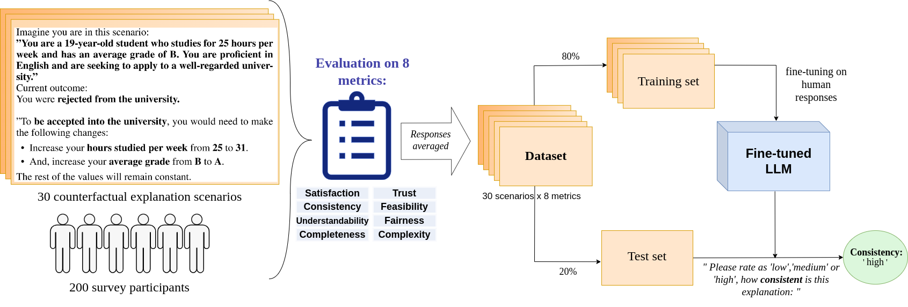

# Towards Unifying Evaluation of Counterfactual Explanations: Leveraging Large Language Models for Human-Centric Assessments

This repository is the official implementation and supplementary materials for the paper:  
**"Towards Unifying Evaluation of Counterfactual Explanations: Leveraging Large Language Models for Human-Centric Assessments"**  
by **Marharyta Domnich, Julius Valja, Rasmus Moorits Veski, Giacomo Magnifico, Kadi Tulver, Eduard Barbu, and Raul Vicente.**

---

## 🤔 Introduction

Counterfactual explanations play a vital role in Explainable AI (XAI) by providing actionable insights on how to change inputs to achieve a desired model outcome. Despite their importance, evaluating counterfactual explanations is often fragmented, with metrics and methods lacking grounding in human perspectives. 



To address this gap, our work introduces:  
1. **CounterEval Dataset**: A human-evaluated dataset of 30 counterfactual scenarios rated by 206 participants across eight explanatory quality metrics, including Feasibility, Consistency, Completeness, Trust, and Overall Satisfaction. (Dataset is available in https://huggingface.co/datasets/anitera/CounterEval)  
2. **LLM-based Evaluation Models**: Large Language Models fine-tuned on CounterEval to predict average and individual human judgments, enabling scalable evaluation of counterfactual explanation frameworks.

Our results show that fine-tuned LLMs achieve **up to 85% accuracy** in mimicking human evaluations and outperform current zero-shot approaches. This advancement sets the stage for more consistent and human-aligned XAI evaluation.

---

## 🚀 Main Results

### Highlights from Our Findings
1. **Accuracy of Fine-Tuned LLMs**:
   - Zero-shot evaluations: **63% accuracy**.
   - Fine-tuned evaluations: **85% accuracy** for predicting human ratings.

2. **CounterEval Dataset**:
   - 30 diverse counterfactual scenarios spanning multiple domains.
   - Human evaluations across eight metrics, providing insights into explanatory quality.

## 📦 Model Weights

We provide **fine-tuned LLaMA 3.1 8B model weights** trained on the CounterEval dataset to predict human evaluations of counterfactual explanations.

### File Structure
The repository is organized as follows:
```
CounterEval/
│
├── code/                              # Processing and evaluation scripts
│   ├── data_preparation.ipynb         # Script to preprocess the CounterEval dataset
│   ├── error_analysis_confusion_matrices.ipynb  # Script for confusion matrix and error analysis
│   ├── finetuning_script_llama.py     # Script to fine-tune LLaMA models
│   └── Llama_31_8b_inference.ipynb    # Inference script for the fine-tuned LLaMA 3.1 8B model
│
├── models/                            # Model weights and configurations
│   ├── trained_3.1.8b/                # Fine-tuned LLaMA 3.1 8B model directory
│   │   ├── adapter_config.json        # Model configuration file
│   │   ├── adapter_model.safetensors  # Model weights (tracked via Git LFS)
│   │   ├── tokenizer.json             # Tokenizer file
│   │   ├── tokenizer_config.json      # Tokenizer configuration
│   │   ├── special_tokens_map.json    # Special tokens mapping
│   │   ├── training_args.bin          # Training arguments and settings
│   │   └── README.md                  # Details about the fine-tuned model
│
├── appendix_Towards_unifying_evaluation_for_counterfactual_explanations.pdf  
│   # Technical appendix containing detailed experiments and methodologies
│
└── README.md                          # Overview and documentation
```

---

### ⬇️ Downloading the Model Weights
The fine-tuned LLaMA-3.1 8B weights are stored under models/trained_3.1.8b/ and tracked using Git LFS.

```bash
git lfs install
git clone https://github.com/your_username/countereval.git
